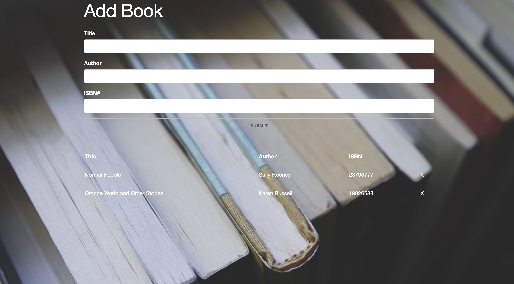

# Book-list

### Goal: Create an app where users can keep track of the books that they have read. User should be able to input a book title, book author and book isbn number that will populate to a list. Once books are added to the list, users can then delete a book from the list.

Technologies Used:
- ejs
- bootstrap
- javascript
- nodejs
- express
- mongodb

To use:

- clone this repo
- in termimal run 'npm install' to install node modules
- run 'node server.js'
- navigate to localhost:3000
